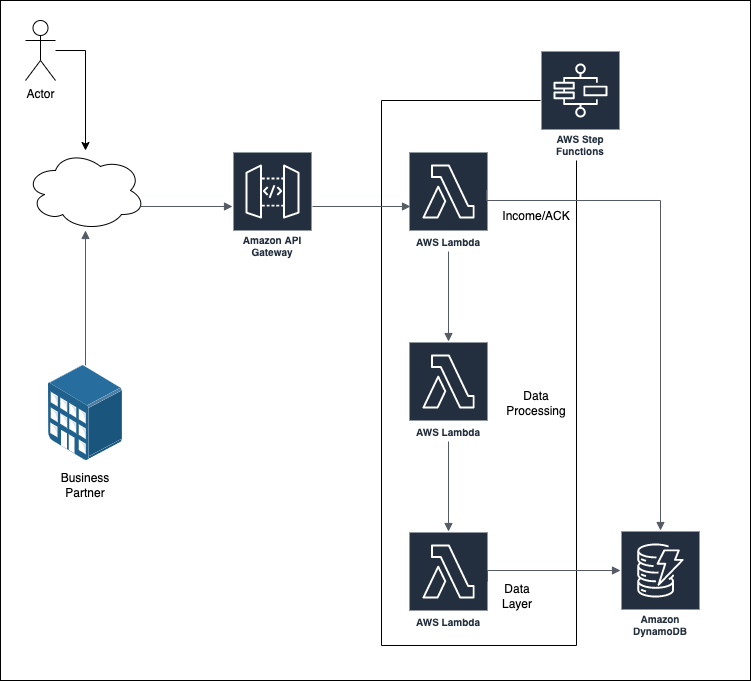

# UNOID Project

## Brief
Platform to use good relationship history to benefit from multiple platforms. Currently, many platforms use direct interactions between users (peer-to-peer) to support their business. Reliability is a decisive factor because peer-to-peer relies on past references to create future relationships. Imagine Airbnb, CouchSurfing, RideShare, MercadoLivre, Rappi and others having as an asset a unified base in which users who have great trust in one can use this asset in others. The model is B2B and not B2C, customers are companies that demand a curated user base. The base is fed by partners and shared among other partners an extra layer of reliability is the fact that this base is supported by blockchain, a distributed technology without unified management and that exempts information about users.

## Value to the customer (partner):
- Reduce your entry curve by having a validated user base with reliability.
- A validated foundation leverages your business transactions among users who will see each other as trustworthy from day one.
- Stay focused on your business and use the expertise of those who are dedicated to creating a referral base.
- Scalable for all sizes of organizations, pay by the amount of requests.
- User historical data is retrieved immediately, but your customers will only be available to others when they consent.

## Operation:
- Registrations are carried out by platforms that enter user data.
- The base collects data on reliability and good use of these users.
- Communication is based on open communication systems with APIs.
- The business model is on demand, that is, partners pay for the amount of use.

## For the risk matrix:
- A partner shares its users with the platform. As this information is restricted to him and still manages to generate value for others. Mechanisms such as a user's history can only be made available to a company that has received the registration of that user.

## Features:
- Expose API for authenticated access by partners.
- User data needs to be standard and the API needs to be universal and clear in specification.
- Restriction of access to data provided that the applicant has authorization from the end user.
- Use Blockchain to ensure the reliability of user transactions.

## PoC Architectural Reference:

  

### Income/ACK
Decoupled sync and acknowledge of Incoming Transactions. Read/Write.

### Data Processing
Data manuipulation layer.

### Data Layer
Write layer to Storage. Schema and Index control.
